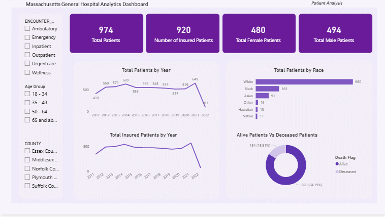
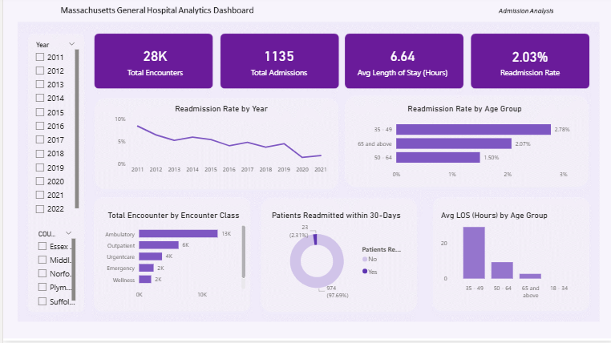
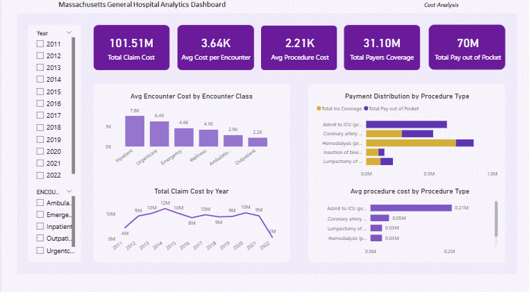

 # 🏥 Healthcare Analytics Project – Massachusetts General Hospital

## Introduction

This project analyses historical healthcare data from Massachusetts General Hospital to evaluate patient outcomes, hospital operations, and financial performance. Using Power BI, the project transforms raw healthcare data into interactive dashboards and actionable insights that support data-driven clinical, operational, and financial decision-making.

## Project Description

This healthcare analytics project covers business problem understanding, data preparation, data modelling, analysis, dashboard development, and business recommendations. The analysis addresses key business questions related to patient demographics, admissions, readmissions, length of stay, procedure costs, and insurance coverage to uncover insights that support better clinical and operational decision-making.

## Project Aim

- Analyse patient admission and readmission trends.
- Evaluate length of stay across patient groups.
- Assess procedure costs and insurance coverage.
- Identify key operational and financial insights.
- Provide data-driven recommendations to improve patient care and hospital performance.

## About the Dataset

### Source

Massachusetts General Hospital (Synthetic Healthcare Dataset)

### Data Structure

The dataset consists of five related tables:

- **Patients:** 974 rows, 20 columns
- **Encounters:** 27,891 rows, 14 columns
- **Procedures:** 47,701 rows, 9 columns
- **Payers:** 10 rows, 7 columns
- **Dictionary:** Reference table

## Tools / Techniques Used

Power BI: Power Query, Data Modelling, Relationships, DAX Measures, Calculated Columns, Interactive Dashboards, KPIs, and Visualisations.
  
## Importing the Dataset

The datasets were imported into Power BI, where Power Query was used for data cleaning and transformation. The cleaned tables were modelled to support interactive dashboard development and analysis.

## Data Cleaning & Transformation

The following data preparation steps were performed:

- Replaced blank spaces with null values.
- Renamed unclear column names.
- Removed unnecessary columns.
- Standardised inconsistent text formatting using Proper Case.
- Expanded abbreviations (e.g., **S** → **Single**).
- Verified and corrected data types.

## Data Modelling

A star schema was implemented with the **Encounters** table serving as the central fact table. The **Patients**, **Procedures**, and **Payers** tables were connected through one-to-many relationships to support efficient analysis and reporting.

## Data Analysis

The analysis focused on patient demographics, admission and readmission trends,Length of Stay and financial performance, including procedure costs, insurance coverage, and healthcare cost trends.

## Data Visualisation

### Patient Overview Dashboard

**KPIs**

- Total Patients
- Total Insured Patients
- Total Male Patients
- Total Female Patients

**Visuals**

- Total Patients by Year
- Total Insured Patients by Year
- Total Patients by Race
- Alive vs Deceased Patients

### Admission & Length of Stay Dashboard

**KPIs**

- Total Encounters
- Total Admissions
- Average Length of Stay
- Readmission Rate

**Visuals**

- Readmission Rate by Year
- Readmission Rate by Age Group
- Total Encounters by Encounter Class
- Patients Readmitted Within 30 Days
- Average Length of Stay by Age Group

### Financial Analysis Dashboard

**KPIs**

- Total Claim Cost
- Average Cost per Encounter
- Average Procedure Cost
- Total Payer Coverage
- Total Out-of-Pocket Payment

**Visuals**

- Average Encounter Cost by Encounter Class
- Total Claim Cost by Year
- Payment Distribution by Procedure Type
- Average Procedure Cost by Procedure Type

## Key Insights

### Patient Overview

- The hospital recorded **974 patients**, including **920 insured patients**, with a nearly equal gender distribution (**494 males** and **480 females**), indicating a balanced patient population and high insurance coverage.
- Patient admissions and insured patients increased steadily from **2011 to 2021**, reflecting sustained growth in healthcare utilisation. The lower figures recorded in **2022** were due to incomplete data.
- **White patients (680)** accounted for the largest proportion of the patient population, followed by **Black (163)** and **Asian (91)** patients, while **Native patients (11)** represented the smallest group.
- With **84.19% (820)** of patients recorded as alive compared to **15.81% (154)** deceased, the hospital demonstrated generally positive patient outcomes.

### Admission & Length of Stay

- The hospital recorded approximately **28,000 encounters**, **1,135 admissions**, an **average length of stay of 6.64 hours**, and a **30-day readmission rate of 2.31%**.
- The **30-day readmission rate** declined from **8.43% in 2011** to **1.82% in 2021**, suggesting improvements in patient management and continuity of care.
- Patients aged **35–49 years** recorded the highest readmission rate (**2.78%**) and the longest average length of stay (**29.31 hours**), which may reflect a higher burden of illness, poor health habits, or more complex medical conditions.
- **Ambulatory** and **Outpatient** encounters accounted for the majority of hospital visits.
- **97.69%** of patients were not readmitted within 30 days, reflecting favourable short-term patient outcomes.

### Financial Analysis

- The hospital recorded a **total claim cost of ₦101.51 million**, with **₦31.10 million** covered by insurance and approximately **₦70 million** paid out of pocket.
- **Inpatient encounters** recorded the highest average cost per encounter, followed by **Urgent Care** and **Emergency**.
- Total claim costs increased from **₦4 million in 2011** to **₦12 million in 2014** before fluctuating through **2021**.
- **ICU admission** was the most expensive procedure, highlighting the high resource requirements associated with critical care.
- Although insurance covered a substantial portion of high-cost procedures, patients still incurred significant out-of-pocket expenses.

## Recommendations

- Strengthen discharge planning and post-discharge follow-up for patients aged 35–49 years, who recorded the highest 30-day readmission rate and longest average length of stay, to further reduce avoidable readmissions and improve continuity of care.

- Expand insurance partnerships and enhance coverage for high-cost procedures such as ICU admission, Coronary Artery Bypass Graft (CABG), Hemodialysis, Lumpectomy, and BIC Defibrillator Insertion to minimise patients' out-of-pocket healthcare expenses.

- Optimise resource allocation for Inpatient, Emergency, and Urgent Care services, as these encounter classes recorded the highest average treatment costs, to improve operational efficiency and cost management.

- Implement targeted health education, preventive care, and chronic disease management programmes for patients aged 35–49 years to reduce prolonged hospital stays and improve health outcomes.

- Monitor patient admissions, procedure costs, insurance coverage, and key performance indicators regularly to support evidence-based clinical, operational, and financial decision-making.

## Conclusion

Insights from the analysis of patient demographics, admissions, readmissions, length of stay, procedure costs, and insurance coverage provide a data-driven foundation for improving patient care, optimising resource allocation, reducing healthcare costs, and supporting strategic clinical, operational, and financial decision-making at Massachusetts General Hospital.

## Dashboard Preview

### Patient Overview Dashboard

### Admission & Readmission Dashboard

### Cost Analysis Dashboard

## Project Files

📄 **Project Report (Word)**  
[Download Report](https://docs.google.com/document/d/17Imu_XErnlX29rsfeA3dPGjeM7WpEBlM/edit?usp=drivesdk&ouid=101892858409209555517&rtpof=true&sd=true)

📊 **Power BI Dashboard (.pbix)**  
[Download Power BI File](https://drive.google.com/file/d/1L1Hf2otpnEbwFLHu_c_lK4SPgTT5XOVi/view?usp=drivesdk)
)

##Contact

**Grace Egberis**

- 💼 LinkedIn: *https://www.linkedin.com/in/grace-egberis-91524038a*

  

  

